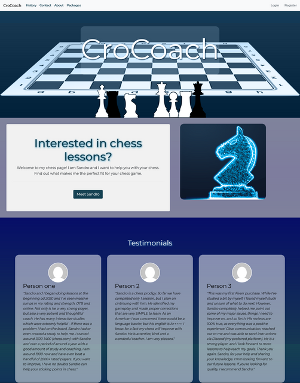
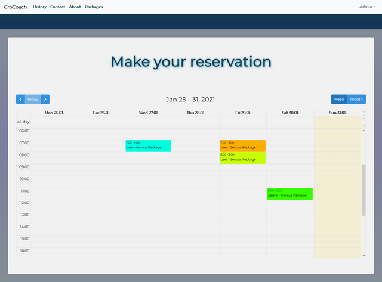
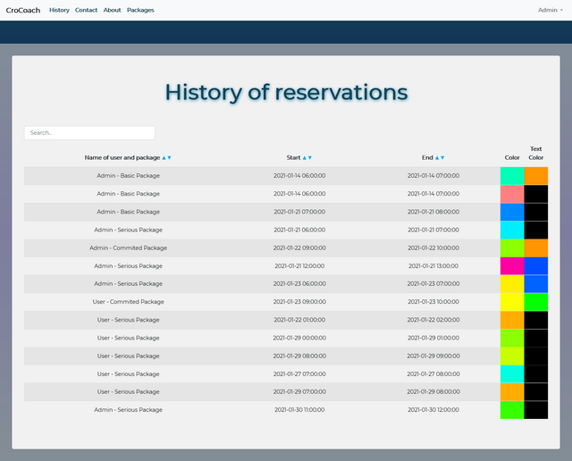
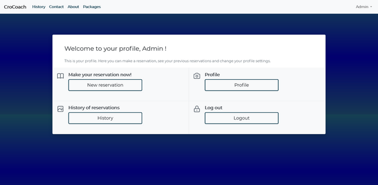
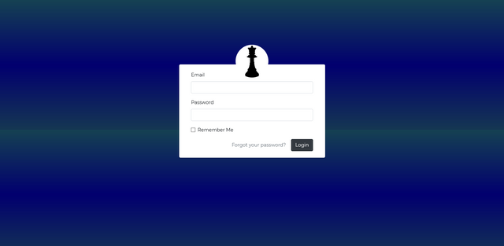
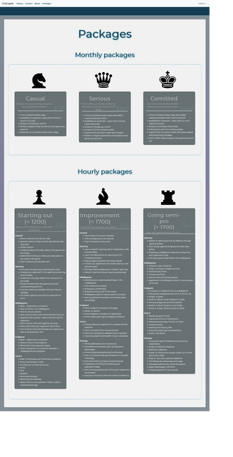

# CroCoach

## Content
- [CroCoach](#crocoach)
  - [Content](#content)
  - [About this project](#about-this-project)
  - [How to run this project](#how-to-run-this-project)
  - [Design and UI](#design-and-ui)
    - [Home page](#home-page)
    - [Reservation calendar](#reservation-calendar)
    - [History of reservations](#history-of-reservations)
    - [Dashbaord](#dashbaord)
    - [Log in](#log-in)
    - [View for packages](#view-for-packages)
  - [License](#license)

## About this project
This is a simple reservation system for chess lessons made in Laravel.

Additional packages and libraries:
- FullCalendar

## How to run this project
Download or git clone this folder

Clone the repository to *C:\xampp\htdocs* 

Go to  *C:\Windows\System32\drivers\etc* and open file *hosts*, there you should write 
```
127.0.0.1 localhost
127.0.0.1 reservationsystem.test
```
at the bottom. 

Also, you will need to open *C:\xampp\apache\conf\extra* and open file httpd-vhosts.conf and paste following code at the bottom:
```
<VirtualHost *:80>
    DocumentRoot "C:/xampp/htdocs"
    ServerName localhost
</VirtualHost>

<VirtualHost *:80>
    DocumentRoot "C:/xampp/htdocs/reservationsystem/public"
    ServerName reservationsystem.test
</VirtualHost>
```
Turn on xampp for Apache and MySQL.

Now you are ready to open your project folder in VS Code.


1. ```npm install```
2. ```composer install```
3. Copy the *.env.example.* to a new *.env* file ```cp .env.example .env```
4. Generate app_key ```php artisan key:generate``` 
5. Go to PhpMyAdmin (open xampp -> in the row where MySQL is press Admin), now Create new Table, give it a name, put charset to utf8mb4_unicode_ci
6. Go to .env file in VS Code and put the name of DB_DATABASE=*the name you gave the table*
7. ```php artisan migrate```

For running this project in a browser, you will need to turn on Apache and MySQL in xampp and write reservationsystem.test in the URL.

## Design and UI
### Home page


### Reservation calendar


### History of reservations
Admin can see reservations from all users


### Dashbaord


### Log in


### View for packages



## License

The Laravel framework is open-sourced software licensed under the [MIT license](https://opensource.org/licenses/MIT).
